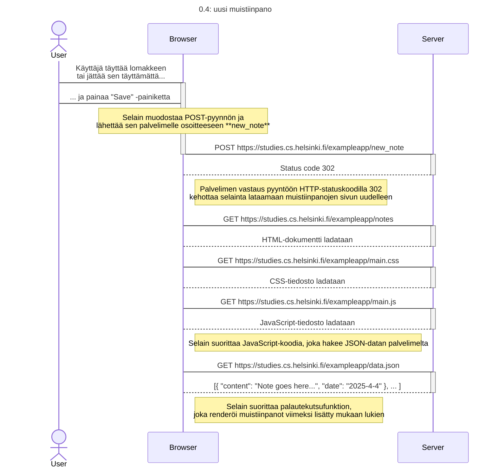

<!-- 0.4: uusi muistiinpano -->

```mermaid

sequenceDiagram

    title 0.4: uusi muistiinpano

    actor User
    participant Browser
    participant Server

    User->Browser: Käyttäjä täyttää lomakkeen<br>tai jättää sen täyttämättä...
    activate Browser
    User->Browser: ... ja painaa "Save" -painiketta
    note over Browser: Selain muodostaa POST-pyynnön ja<br>lähettää sen palvelimelle osoitteeseen **new_note**
    
    Browser->Server: POST https://studies.cs.helsinki.fi/exampleapp/new_note
    deactivate Browser
    activate Server
    Server-->Browser: Status code 302
    deactivate Server
    note right of Browser: Palvelimen vastaus pyyntöön HTTP-statuskoodilla 302<br>kehottaa selainta lataamaan muistiinpanojen sivun uudelleen
    
    Browser->Server: GET https://studies.cs.helsinki.fi/exampleapp/notes
    activate Server
    Server-->Browser: HTML-dokumentti ladataan
    deactivate Server
    
    Browser->Server: GET https://studies.cs.helsinki.fi/exampleapp/main.css
    activate Server
    Server-->Browser: CSS-tiedosto ladataan
    deactivate Server
    
    Browser->Server: GET https://studies.cs.helsinki.fi/exampleapp/main.js
    activate Server
    Server-->Browser: JavaScript-tiedosto ladataan
    deactivate Server
    
    note right of Browser: Selain suorittaa JavaScript-koodia, joka hakee JSON-datan palvelimelta
    
    Browser->Server: GET https://studies.cs.helsinki.fi/exampleapp/data.json
    activate Server
    Server-->Browser: [{ "content": "Note goes here...", "date": "2025-4-4" }, ... ]
    deactivate Server

    note right of Browser: Selain suorittaa palautekutsufunktion,<br>joka renderöi muistiinpanot viimeksi lisätty mukaan lukien

```
